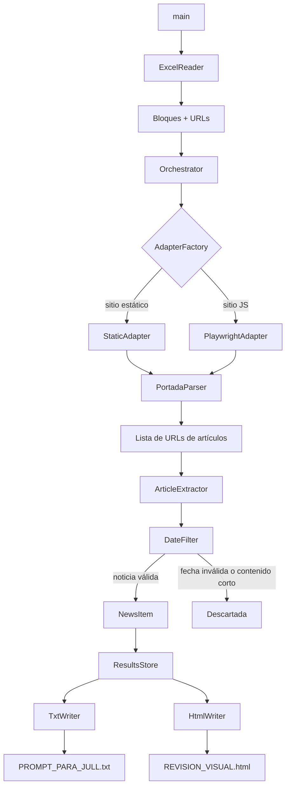
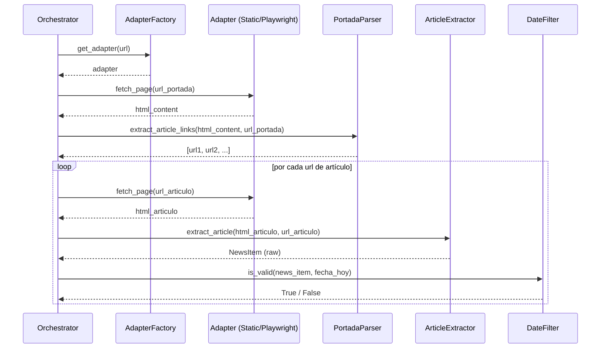
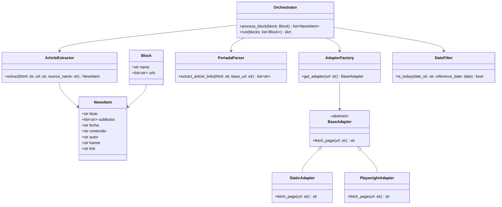

# Documento de Diseño Técnico
# Vinotinto Galáctico Scraper

---

## Visión General

El sistema **Vinotinto Galáctico Scraper** es una herramienta de extracción automatizada de noticias deportivas. Lee fuentes web organizadas por bloques temáticos desde un archivo Excel, extrae artículos del día actual y genera dos archivos de salida: un `.txt` estructurado como prompt para el personaje JULL y un `.html` con estilo de web deportiva para revisión visual.

### Problema Central

No todas las fuentes web pueden extraerse con la misma estrategia:

- **Sitios estáticos (HTML puro)**: `as.com`, `marca.com`, `mundodeportivo.com`, `sport.es`, `meridiano.net`, `lavinotinto.com`, `balonazos.com`, `liderendeportes.com`, `defensacentral.com`, `madridistareal.com`, `estadiodeportivo.com`, `europapress.es`, `ligafutve.org`, `fvf.com.ve` → se pueden scrapear con `requests` + `BeautifulSoup`.
- **Sitios JavaScript/SPA**: `realmadrid.com`, `laliga.com` → requieren un navegador headless (Playwright) porque el contenido se renderiza en el cliente.

El diseño introduce una **arquitectura de adaptadores** que encapsula esta diferencia de forma transparente para el resto del sistema.

### Decisiones de Diseño Clave

| Decisión | Alternativa descartada | Razón |
|---|---|---|
| Playwright para sitios JS | Selenium | Playwright es más moderno, tiene mejor soporte async y API más limpia |
| Adaptadores por dominio | Parser genérico único | El parser genérico falla silenciosamente en sitios JS; los adaptadores permiten lógica específica por sitio |
| Extracción de fecha con múltiples estrategias | Solo meta tags | Los sitios usan formatos muy distintos; se necesita fallback en cascada |
| Contenido completo sin truncar | Límite de caracteres | El truncado a 2000 chars elimina información valiosa para JULL |

---

## Arquitectura

### Diagrama de Alto Nivel



### Diagrama de Flujo de Extracción por URL



---

## Componentes e Interfaces

### 1. `ExcelReader`

Responsabilidad: leer `Prensa Deportiva.xlsx` y devolver la estructura de bloques con sus URLs, preservando el orden exacto.

```python
class ExcelReader:
    def __init__(self, filepath: str): ...
    def read(self) -> list[Block]:
        """
        Retorna lista de Block en el orden del Excel.
        Ignora filas vacías o con valor 'nan'.
        Lanza FileNotFoundError si el archivo no existe.
        """
```

### 2. `Block` (modelo de datos)

```python
@dataclass
class Block:
    name: str          # Nombre exacto del bloque (ej. "REAL MADRID")
    urls: list[str]    # URLs en el orden del Excel
```

### 3. `AdapterFactory`

Responsabilidad: seleccionar el adaptador correcto según el dominio de la URL.

```python
# Mapa de dominios que requieren Playwright
JS_DOMAINS = {"realmadrid.com", "laliga.com"}

class AdapterFactory:
    def get_adapter(self, url: str) -> BaseAdapter:
        domain = extract_domain(url)
        if domain in JS_DOMAINS:
            return PlaywrightAdapter()
        return StaticAdapter()
```

### 4. `BaseAdapter` (interfaz)

```python
class BaseAdapter(ABC):
    @abstractmethod
    def fetch_page(self, url: str) -> str:
        """Retorna el HTML de la página. Lanza AdapterError si falla."""
```

### 5. `StaticAdapter`

Usa `requests` + `BeautifulSoup`. Implementa reintentos y timeout de 10 segundos.

```python
class StaticAdapter(BaseAdapter):
    HEADERS = {'User-Agent': 'Mozilla/5.0 (Windows NT 10.0; Win64; x64) ...'}
    TIMEOUT = 10

    def fetch_page(self, url: str) -> str:
        response = requests.get(url, headers=self.HEADERS, timeout=self.TIMEOUT)
        response.raise_for_status()
        return response.text
```

### 6. `PlaywrightAdapter`

Usa `playwright` (sync API) para renderizar páginas JavaScript. Espera a que el DOM esté estable antes de retornar el HTML.

```python
class PlaywrightAdapter(BaseAdapter):
    def fetch_page(self, url: str) -> str:
        with sync_playwright() as p:
            browser = p.chromium.launch(headless=True)
            page = browser.new_page()
            page.goto(url, wait_until="networkidle", timeout=30000)
            html = page.content()
            browser.close()
            return html
```

### 7. `PortadaParser`

Responsabilidad: dado el HTML de una portada, extraer los enlaces a artículos individuales. Aplica heurísticas mejoradas respecto al código actual.

```python
class PortadaParser:
    # Patrones de URL que indican artículos (ampliados)
    ARTICLE_PATTERNS = [
        r'/articulo/', r'/noticias/', r'\.html$',
        r'/\d{4}/', r'/noticia-', r'/news/', r'/futbol/'
    ]
    # Patrones a excluir (navegación, redes sociales, etc.)
    EXCLUDE_PATTERNS = [
        r'#', r'javascript:', r'mailto:', r'/tag/', r'/autor/',
        r'twitter\.com', r'facebook\.com', r'instagram\.com'
    ]

    def extract_article_links(self, html: str, base_url: str) -> list[str]:
        """
        Retorna hasta 3 URLs de artículos encontradas en la portada.
        Resuelve URLs relativas usando base_url.
        """
```

### 8. `ArticleExtractor`

Responsabilidad: dado el HTML de un artículo, extraer todos los campos requeridos. Implementa estrategias de extracción en cascada para cada campo.

```python
class ArticleExtractor:
    def extract(self, html: str, url: str, source_name: str) -> NewsItem | None:
        """
        Extrae todos los campos. Retorna None si el contenido < 200 chars.
        """
```

**Estrategias de extracción por campo:**

| Campo | Estrategia primaria | Fallback 1 | Fallback 2 |
|---|---|---|---|
| Título | `<h1>` | `og:title` meta tag | `<title>` |
| Subtítulos | `<h2>` dentro del artículo | `<h3>` | Omitir |
| Fecha | `<time datetime="">` | `article:published_time` meta | Patrones regex en texto |
| Autor | `[rel="author"]` | `.author`, `.byline` | `article:author` meta → "No disponible" |
| Contenido | `<article>` → `<p>` | `.article-body` → `<p>` | Todos los `<p>` > 70 chars |
| Fuente | Parámetro `source_name` | — | — |
| Link | Parámetro `url` | — | — |

### 9. `DateFilter`

Responsabilidad: determinar si una noticia fue publicada en la fecha actual.

```python
class DateFilter:
    RELATIVE_PATTERNS = {
        'hace': 0,       # "hace X horas/minutos" → hoy
        'today': 0,
        'hoy': 0,
    }

    def is_today(self, date_str: str, reference_date: date) -> bool:
        """
        Intenta parsear date_str con múltiples formatos.
        Acepta fechas relativas como "hace 2 horas".
        Retorna False si no puede determinar la fecha.
        """
```

**Formatos de fecha soportados:**
- `DD/MM/YYYY`, `YYYY-MM-DD`, `DD-MM-YYYY`
- ISO 8601: `YYYY-MM-DDTHH:MM:SS`
- Texto relativo: `"hace X horas"`, `"hace X minutos"`, `"hoy"`
- Texto en español: `"15 de enero de 2025"`

### 10. `NewsItem` (modelo de datos)

```python
@dataclass
class NewsItem:
    titulo: str
    subtitulos: list[str]      # Lista vacía si no hay subtítulos
    fecha: str                 # Formato DD/MM/YYYY
    contenido: str             # Completo, sin truncar
    autor: str                 # "No disponible" si no se encuentra
    fuente: str                # Nombre del medio
    link: str
```

### 11. `Orchestrator`

Responsabilidad: coordinar el flujo completo de extracción respetando límites, delays y manejo de errores.

```python
class Orchestrator:
    def __init__(self, adapter_factory, portada_parser, article_extractor, date_filter): ...

    def process_block(self, block: Block) -> list[NewsItem]:
        """
        Procesa un bloque completo.
        - Respeta límite de MAX_NOTICIAS_POR_BLOQUE (5)
        - Espera 1 segundo entre solicitudes HTTP
        - Captura excepciones por URL sin interrumpir el bloque
        """

    def run(self, blocks: list[Block]) -> dict[str, list[NewsItem]]:
        """
        Procesa todos los bloques y retorna el diccionario de resultados.
        Preserva el orden de los bloques.
        """
```

### 12. `TxtWriter`

Responsabilidad: generar `PROMPT_PARA_JULL.txt` con el formato estructurado completo.

```python
class TxtWriter:
    def write(self, results: dict[str, list[NewsItem]], fecha: str, output_path: str): ...
```

**Formato de salida:**
```
PROTOCOLO VINOTINTO GALÁCTICO - DATA DE EXTRACCIÓN
FECHA: DD/MM/YYYY

=== SECCIÓN: NOMBRE_BLOQUE ===
NOTICIA 1:
TITULO: ...
SUBTITULOS: ... (si existen)
FECHA: ...
CONTENIDO: ... (completo)
AUTOR: ...
FUENTE: ...
LINK: ...

[instrucciones para JULL al final]
```

### 13. `HtmlWriter`

Responsabilidad: generar `REVISION_VISUAL.html` con estilo de web deportiva.

```python
class HtmlWriter:
    def write(self, results: dict[str, list[NewsItem]], fecha: str, output_path: str): ...
```

---

## Modelos de Datos

### Diagrama de Clases



### Estructura del Excel de Entrada

El archivo `Prensa Deportiva.xlsx` tiene una sola columna (sin encabezado). Las filas siguen este patrón:

```
REAL MADRID:
https://www.as.com/real_madrid/
https://www.marca.com/futbol/real-madrid/
LALIGA:
https://www.laliga.com/noticias
...
```

Las filas que terminan en `:` son nombres de bloque. Las filas que empiezan con `http` son URLs. Las filas vacías o `nan` se ignoran.

---

## Propiedades de Corrección

*Una propiedad es una característica o comportamiento que debe cumplirse en todas las ejecuciones válidas del sistema — esencialmente, una declaración formal sobre lo que el sistema debe hacer. Las propiedades sirven como puente entre las especificaciones legibles por humanos y las garantías de corrección verificables por máquinas.*

### Propiedad 1: Preservación de orden de bloques y URLs

*Para cualquier* archivo Excel con cualquier número de bloques y URLs, el orden de los bloques en los archivos de salida (TXT y HTML) debe ser idéntico al orden en que aparecen en el Excel, y el orden de procesamiento de las URLs dentro de cada bloque debe ser idéntico al orden en el Excel.

**Valida: Requisitos 1.3, 1.4, 4.2, 5.2, 6.2**

### Propiedad 2: Filas vacías no afectan el resultado

*Para cualquier* archivo Excel, insertar filas vacías o con valor `nan` en cualquier posición no debe cambiar el conjunto de bloques ni de URLs procesadas.

**Valida: Requisito 1.5**

### Propiedad 3: Límite de noticias por bloque

*Para cualquier* bloque procesado con cualquier número de fuentes disponibles, la cantidad de noticias en el resultado nunca debe superar 5.

**Valida: Requisitos 2.2, 2.3**

### Propiedad 4: Filtro temporal estricto

*Para cualquier* conjunto de noticias con fechas variadas, solo deben aparecer en el resultado aquellas cuya fecha corresponde exactamente a la fecha de ejecución del sistema. Noticias sin fecha verificable deben ser descartadas.

**Valida: Requisitos 2.4, 2.5**

### Propiedad 5: Continuidad ante errores HTTP

*Para cualquier* lista de URLs donde algunas fallan (timeout, error HTTP, excepción de red), el sistema debe continuar procesando las URLs restantes y retornar las noticias extraídas exitosamente, sin lanzar una excepción no capturada.

**Valida: Requisitos 2.7, 6.3, 7.6**

### Propiedad 6: Campos completos en noticia extraída

*Para cualquier* artículo HTML válido con contenido suficiente (≥ 200 caracteres), el `NewsItem` resultante debe contener valores no vacíos para: `titulo`, `fecha`, `contenido`, `fuente` y `link`. El campo `autor` debe ser `"No disponible"` si no se encuentra, nunca vacío ni `None`.

**Valida: Requisitos 3.1, 3.2**

### Propiedad 7: Contenido sin truncar

*Para cualquier* artículo HTML, la longitud del campo `contenido` en el `NewsItem` extraído debe ser igual a la longitud del texto completo del artículo en el HTML fuente (sin límite artificial de caracteres).

**Valida: Requisito 3.4**

### Propiedad 8: Descarte de noticias con contenido insuficiente

*Para cualquier* artículo cuyo contenido extraído tenga menos de 200 caracteres, el sistema debe descartarlo y no incluirlo en el resultado del bloque.

**Valida: Requisito 3.5**

### Propiedad 9: Campos completos en Prompt_JULL

*Para cualquier* `NewsItem` incluido en el resultado, el archivo `PROMPT_PARA_JULL.txt` generado debe contener, para esa noticia, todos los campos: título, fecha, contenido completo, autor, fuente y link. Si existen subtítulos, también deben aparecer.

**Valida: Requisito 4.4**

### Propiedad 10: Omisión de bloques vacíos en salida

*Para cualquier* bloque que no tenga noticias del día actual, ese bloque no debe aparecer ni en el `PROMPT_PARA_JULL.txt` ni en el `REVISION_VISUAL.html`.

**Valida: Requisitos 4.5, 5.6**

### Propiedad 11: Campos completos en HTML

*Para cualquier* `NewsItem` incluido en el resultado, el archivo `REVISION_VISUAL.html` generado debe contener, para esa noticia, todos los campos visibles: título, fecha, contenido completo, autor, fuente y un enlace al artículo original.

**Valida: Requisito 5.5**

### Propiedad 12: Nombres de bloques preservados exactamente

*Para cualquier* nombre de bloque en el Excel, el nombre que aparece en los archivos de salida debe ser idéntico al original, sin modificaciones de capitalización, espacios ni formato.

**Valida: Requisito 6.4**

---

## Manejo de Errores

### Jerarquía de Excepciones

```python
class VGScraperError(Exception): pass
class ExcelReadError(VGScraperError): pass      # Archivo no encontrado o corrupto
class AdapterError(VGScraperError): pass         # Fallo de red o timeout
class ExtractionError(VGScraperError): pass      # Fallo al parsear HTML
class DateParseError(VGScraperError): pass       # No se puede determinar la fecha
```

### Política de Manejo por Nivel

| Nivel | Error | Acción |
|---|---|---|
| `ExcelReader` | Archivo no encontrado | Lanza `ExcelReadError`, detiene ejecución |
| `Adapter.fetch_page` | Timeout / HTTP error | Lanza `AdapterError` |
| `Orchestrator.process_block` | `AdapterError` en una URL | Log en consola, continúa con siguiente URL |
| `ArticleExtractor.extract` | HTML malformado | Retorna `None`, log en consola |
| `DateFilter.is_today` | Formato de fecha desconocido | Retorna `False` (descarta la noticia) |
| `TxtWriter` / `HtmlWriter` | Error de escritura | Lanza excepción, log en consola |

### Comportamiento ante Sitios JavaScript sin Playwright

Si `playwright` no está instalado y se intenta acceder a un sitio JS, `PlaywrightAdapter` debe capturar el `ImportError` y lanzar un `AdapterError` con un mensaje descriptivo que indique cómo instalar Playwright.

---

## Estrategia de Testing

### Enfoque Dual: Tests Unitarios + Tests Basados en Propiedades

Los tests unitarios verifican ejemplos concretos y casos borde. Los tests basados en propiedades verifican invariantes universales con entradas generadas aleatoriamente. Ambos son complementarios y necesarios.

### Tests Unitarios

Cubren casos específicos y de integración:

- `test_excel_reader_file_not_found`: verifica que se lanza `ExcelReadError` cuando el archivo no existe.
- `test_excel_reader_preserves_order`: verifica con un Excel de ejemplo que el orden se preserva.
- `test_static_adapter_timeout`: verifica que un timeout lanza `AdapterError`.
- `test_playwright_adapter_not_installed`: verifica el mensaje de error cuando Playwright no está disponible.
- `test_article_extractor_no_author`: verifica que el autor es `"No disponible"` cuando no está en el HTML.
- `test_article_extractor_no_subtitles`: verifica que subtítulos es lista vacía cuando no hay `<h2>`.
- `test_date_filter_relative_today`: verifica que `"hace 2 horas"` se acepta como hoy.
- `test_date_filter_yesterday`: verifica que una fecha de ayer se rechaza.
- `test_html_writer_utf8`: verifica que el HTML generado tiene `charset=utf-8`.
- `test_html_writer_color_corporativo`: verifica que el HTML contiene `#800020`.
- `test_html_writer_text_justify`: verifica que el CSS incluye `text-align: justify`.
- `test_txt_writer_includes_jull_instructions`: verifica que el TXT incluye la sección de instrucciones para JULL.
- `test_txt_writer_no_temporal_closings`: verifica que las instrucciones prohíben cierres temporales.

### Tests Basados en Propiedades

Librería: **`hypothesis`** (Python).
Configuración: mínimo 100 iteraciones por test (`@settings(max_examples=100)`).

Cada test referencia su propiedad de diseño con el tag:
`# Feature: vinotinto-galactico-scraper, Property N: <texto>`

```python
# Feature: vinotinto-galactico-scraper, Property 1: Preservación de orden
@given(blocks=st.lists(block_strategy(), min_size=1, max_size=10))
@settings(max_examples=100)
def test_property_1_order_preserved(blocks):
    results = orchestrator.run(blocks)
    assert list(results.keys()) == [b.name for b in blocks if b.name in results]

# Feature: vinotinto-galactico-scraper, Property 2: Filas vacías no afectan resultado
@given(blocks=st.lists(block_strategy()), empty_rows=st.integers(min_value=0, max_value=10))
@settings(max_examples=100)
def test_property_2_empty_rows_ignored(blocks, empty_rows):
    # Insertar filas vacías en posiciones aleatorias no cambia el resultado
    ...

# Feature: vinotinto-galactico-scraper, Property 3: Límite de noticias por bloque
@given(block=block_strategy_with_many_sources())
@settings(max_examples=100)
def test_property_3_max_5_news_per_block(block):
    result = orchestrator.process_block(block)
    assert len(result) <= 5

# Feature: vinotinto-galactico-scraper, Property 4: Filtro temporal estricto
@given(news_items=st.lists(news_item_strategy_with_random_dates()))
@settings(max_examples=100)
def test_property_4_date_filter(news_items):
    filtered = [n for n in news_items if date_filter.is_today(n.fecha, date.today())]
    for item in filtered:
        assert parse_date(item.fecha) == date.today()

# Feature: vinotinto-galactico-scraper, Property 5: Continuidad ante errores HTTP
@given(urls=st.lists(st.one_of(valid_url_strategy(), failing_url_strategy())))
@settings(max_examples=100)
def test_property_5_continues_on_error(urls):
    # No debe lanzar excepción no capturada
    try:
        orchestrator.process_urls(urls)
    except VGScraperError:
        pytest.fail("Se lanzó excepción no capturada")

# Feature: vinotinto-galactico-scraper, Property 6: Campos completos en NewsItem
@given(html=article_html_strategy(min_content_length=200))
@settings(max_examples=100)
def test_property_6_complete_fields(html):
    item = extractor.extract(html, "http://example.com", "Test")
    assert item is not None
    assert item.titulo and item.fecha and item.contenido
    assert item.autor  # nunca vacío ni None
    assert item.fuente and item.link

# Feature: vinotinto-galactico-scraper, Property 7: Contenido sin truncar
@given(html=article_html_strategy())
@settings(max_examples=100)
def test_property_7_content_not_truncated(html):
    item = extractor.extract(html, "http://example.com", "Test")
    if item:
        expected_text = extract_raw_text(html)
        assert len(item.contenido) >= len(expected_text) * 0.9  # margen por limpieza

# Feature: vinotinto-galactico-scraper, Property 8: Descarte de noticias cortas
@given(html=article_html_strategy(max_content_length=199))
@settings(max_examples=100)
def test_property_8_short_content_discarded(html):
    item = extractor.extract(html, "http://example.com", "Test")
    assert item is None

# Feature: vinotinto-galactico-scraper, Property 9: Campos completos en TXT
@given(results=results_strategy())
@settings(max_examples=100)
def test_property_9_txt_complete_fields(results):
    txt_writer.write(results, "01/01/2025", "/tmp/test.txt")
    content = open("/tmp/test.txt").read()
    for block_news in results.values():
        for item in block_news:
            assert item.titulo in content
            assert item.contenido in content
            assert item.autor in content

# Feature: vinotinto-galactico-scraper, Property 10: Omisión de bloques vacíos
@given(results=results_strategy_with_empty_blocks())
@settings(max_examples=100)
def test_property_10_empty_blocks_omitted(results):
    txt_writer.write(results, "01/01/2025", "/tmp/test.txt")
    html_writer.write(results, "01/01/2025", "/tmp/test.html")
    txt_content = open("/tmp/test.txt").read()
    html_content = open("/tmp/test.html").read()
    for block_name, news in results.items():
        if not news:
            assert block_name not in txt_content
            assert block_name not in html_content

# Feature: vinotinto-galactico-scraper, Property 11: Campos completos en HTML
@given(results=results_strategy())
@settings(max_examples=100)
def test_property_11_html_complete_fields(results):
    html_writer.write(results, "01/01/2025", "/tmp/test.html")
    content = open("/tmp/test.html").read()
    for block_news in results.values():
        for item in block_news:
            assert item.titulo in content
            assert item.link in content

# Feature: vinotinto-galactico-scraper, Property 12: Nombres de bloques preservados
@given(blocks=st.lists(block_strategy(), min_size=1))
@settings(max_examples=100)
def test_property_12_block_names_exact(blocks):
    results = orchestrator.run(blocks)
    for block in blocks:
        if block.name in results:
            assert block.name in results  # nombre exacto, sin modificar
```

### Estructura de Archivos de Test

```
tests/
├── unit/
│   ├── test_excel_reader.py
│   ├── test_adapters.py
│   ├── test_portada_parser.py
│   ├── test_article_extractor.py
│   ├── test_date_filter.py
│   ├── test_txt_writer.py
│   └── test_html_writer.py
├── property/
│   └── test_properties.py
└── fixtures/
    ├── sample_portada.html
    ├── sample_article.html
    └── sample_excel.xlsx
```

### Dependencias de Testing

```
pytest
hypothesis
pytest-mock
responses  # para mockear requests HTTP
```
